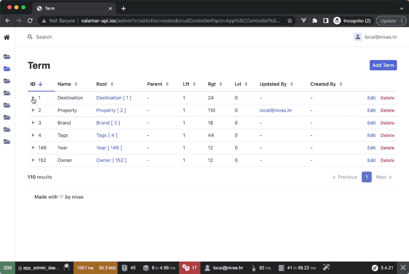

# easyadmin-tree-list-bundle

EasyAdmin 3.x / Symfony 5.x compatible bundle which overrides default EasyAdmin index (list) templates and adds nested tree view on list for entities that use [Gedmo Tree extension](https://github.com/doctrine-extensions/DoctrineExtensions).




In order to achieve nested tree view, your entity must implement nested Gedmo tree on entity and following properties:

- `root_id` property 
- `parent_id` property
- `lft` (left) property
- `rgt` (right) property
- `lvl` (level) property

Example of such entity: https://github.com/doctrine-extensions/DoctrineExtensions/blob/main/doc/tree.md

## Notable mentions and some history

On many Symfony 4 projects, we used `2lenet/EasyAdminPlusBundle`'s tree view feature. As we migrated projects to Symfony v5 / EasyAdmin v3 and Symfony v6 / EasyAdmin v4 - we lacked this simple tree view feature and decided to make tree view work again. 

Hopefully bundle will work on PHP 8, Symfony 6 & EasyAdmin v4 as well (not yet tested).

History:

- [WandiParis/EasyAdminPlusBundle](https://github.com/WandiParis/EasyAdminPlusBundle) original bundle from which everything started
- [2lenet/EasyAdminPlusBundle](https://github.com/2lenet/EasyAdminPlusBundle) which forked `WandiParis/EasyAdminPlusBundle` and added tree view and made it work for EasyAdmin v1
- [uknight/EasyAdminPlusBundle](https://github.com/uknight/EasyAdminPlusBundle) which forked `2lenet/EasyAdminPlusBundle` and made it work for EasyAdmin v2

 To achieve tree functionality in templates, really old [jQuery treetable Plugin 3.2.0](http://ludo.cubicphuse.nl/jquery-treetable) was used from Ludo van den Boom, just like in `2lenet/EasyAdminPlusBundle` bundle. Will check out how to replace it with something recent.

## Installation


```
composer require nivas/easyadmin-tree-list-bundle
```

after installation your `bundles.php` will contain new bundle:

```
<?php

return [
...
    Nivas\Bundle\EasyAdminTreeListBundle\EasyAdminTreeListBundle::class => ['all' => true],
];
```

## Configuration

As mentioned previously, your entity must implement Gedmo Tree.

Your EasyAdmin CRUD controller should override:
- `configureResponseParameters` - used to enable tree config for twig
- `createIndexQueryBuilder` - used to change sorting order needed to make a tree list
- `configureActions` - used to remove batch actions in front of tree navigation arrow

Example of `src/Controller/Admin/TermCrudController.php`

```
<?php

namespace App\Controller\Admin;

use App\Entity\Term;
use EasyCorp\Bundle\EasyAdminBundle\Config\Crud;
use EasyCorp\Bundle\EasyAdminBundle\Controller\AbstractCrudController;
use EasyCorp\Bundle\EasyAdminBundle\Field\AssociationField;
use EasyCorp\Bundle\EasyAdminBundle\Field\IntegerField;
use EasyCorp\Bundle\EasyAdminBundle\Field\TextField;
use EasyCorp\Bundle\EasyAdminBundle\Config\KeyValueStore;

// za custom order query
use EasyCorp\Bundle\EasyAdminBundle\Dto\EntityDto;
use EasyCorp\Bundle\EasyAdminBundle\Dto\SearchDto;
use EasyCorp\Bundle\EasyAdminBundle\Orm\EntityRepository;
use EasyCorp\Bundle\EasyAdminBundle\Collection\FieldCollection;
use EasyCorp\Bundle\EasyAdminBundle\Collection\FilterCollection;
use Doctrine\ORM\QueryBuilder;

// za ugasit akcije
use EasyCorp\Bundle\EasyAdminBundle\Config\Actions;
use EasyCorp\Bundle\EasyAdminBundle\Config\Action;

class TermCrudController extends AbstractCrudController
{
    public function configureResponseParameters(KeyValueStore $responseParameters): KeyValueStore
    {
        $responseParameters->set('tree', true);
        return $responseParameters;
    }

    // not needed, it looks better this way
    public function configureActions(Actions $actions): Actions
    {
        return $actions
            ->disable(Action::BATCH_DELETE);
    }    

    public function createIndexQueryBuilder(SearchDto $searchDto, EntityDto $entityDto, FieldCollection $fields, FilterCollection $filters): QueryBuilder
    {
        $qb = $this->get(EntityRepository::class)->createQueryBuilder($searchDto, $entityDto, $fields, $filters);
        $qb->resetDQLPart('orderBy');
        $qb->addOrderBy($qb->getRootAlias().'.root', 'ASC');
        $qb->addOrderBy($qb->getRootAlias().'.lft', 'ASC');
        return $qb;
    }

  ...

}
```


## Easyadmin v2 to v3 migration 

In EasyAdmin v2 you could access value of entity property by typing eg. `entity.id`. Not anymore. this was replaced by EasyAdmin's EntityDTO.

eg:

```
entity.fields.getByProperty('id').value
```

or eg: `entity.root.id` becomes: `entity.fields.getByProperty('root').value.id`

Also, befure it was easy to access custom property defined in yaml (eg. `tree: true` in example below):

```
easy_admin:
  entities:
    Organization:
      class: App\Entity\Organization
      label: 'Organization'
      tree: true
      form:
        fields:
          - name
  ...
```

In templates you would just use `entity.tree` to access it.

Now this is done by overriding `configureResponseParameters` of your admin crud class which extends `AbstractCrudController`:

```
use EasyCorp\Bundle\EasyAdminBundle\Config\KeyValueStore;

class OrganizationCrudController extends AbstractCrudController
{
    public function configureResponseParameters(KeyValueStore $responseParameters): KeyValueStore
    {
        $responseParameters->set('tree', true);
        // $responseParameters->setIfNotSet('bar.foo', '...');

        return $responseParameters;
    }
```

And usage in Twig template:

```

tree je true - {{ tree }}

```
